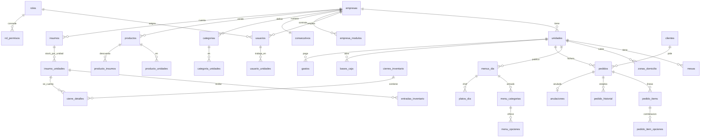

# 🐘 Base de datos Taseca · PostgreSQL

Base de datos multiempresa del proyecto, lista para el entorno de pruebas local
(PostgreSQL en el puerto **5435**, administrada con **DBeaver**).

Probada de punta a punta en **PostgreSQL 17.5**: instalación limpia de 00 a 08 y
20 pruebas funcionales en verde. Requiere **PostgreSQL 15 o superior** por el
orden alfabético en español (ICU `es-CO`).

---

## Instalación en DBeaver

### 1. Crear la base (una sola vez)
1. Abre tu conexión a `localhost:5435`, base **`postgres`**.
2. Abre `00_crear_base_datos.sql` → **Alt+X** (*Ejecutar script*).
   Debe estar en **Auto-commit** (el botón de la barra): `CREATE DATABASE` no
   se puede ejecutar dentro de una transacción.

### 2. Crear una conexión a `taseca_db`
*Base de datos → Nueva conexión → PostgreSQL*, host `localhost`, puerto `5435`,
base `taseca_db`, tu usuario de siempre.

### 3. Ejecutar los scripts en orden
Con la conexión **`taseca_db`** seleccionada, abre cada archivo y ejecútalo con
**Alt+X**, uno tras otro:

| # | Archivo | Qué hace |
|---|---|---|
| 01 | `01_estructura.sql` | Esquemas, 53 tablas, llaves, restricciones e índices |
| 02 | `02_funciones.sql` | Funciones internas: jornada, consecutivo, permisos, PIN |
| 03 | `03_triggers.sql` | 55 triggers con las reglas del negocio |
| 04 | `04_procedimientos.sql` | 29 procedimientos y funciones de escritura (`api`) |
| 05 | `05_vistas.sql` | 33 vistas de lectura + reporte materializado |
| 06 | `06_datos_iniciales.sql` | Catálogos y la estructura real de NASCAR |
| 07 | `07_seguridad.sql` | Roles `taseca_app` y `taseca_lectura` |
| 08 | `08_pruebas.sql` | *(Opcional)* 20 pruebas; se deshacen solas con ROLLBACK |
| 09 | `09_postgrest.sql` | API REST para PostgREST: esquema `rest`, roles y JWT (ver abajo) |
| 10 | `10_optimizacion.sql` | Producción: auditoría liviana con retención, índices, vistas y refresco incremental |
| 11 | `11_fase2_carta_menu.sql` | Fase 2 · bloque 1: editar carta y menú del día desde la aplicación |
| 11 | `11_pruebas_carta_menu.sql` | *(Opcional)* 10 pruebas de carta y menú; se deshacen solas con ROLLBACK |
| 12 | `12_fase2_usuarios_unidades.sql` | Fase 2 · bloque 2: usuarios y unidades / locales desde la aplicación |
| 12 | `12_pruebas_usuarios_unidades.sql` | *(Opcional)* 8 pruebas de usuarios y unidades; se deshacen solas con ROLLBACK |
| 13 | `13_fase2_inventario.sql` | Fase 2 · bloque 3: stock, entradas y cierres de inventario desde la aplicación |
| 13 | `13_pruebas_inventario.sql` | *(Opcional)* 8 pruebas de inventario; se deshacen solas con ROLLBACK |
| 14 | `14_fase2_caja_gastos.sql` | Fase 2 · bloque 4: base de caja, gastos y cruce de caja desde la aplicación |
| 14 | `14_pruebas_caja_gastos.sql` | *(Opcional)* 6 pruebas de caja y gastos; se deshacen solas con ROLLBACK |
| 15 | `15_fase2_configuracion_plataforma.sql` | Fase 2 · bloque 5: configuración, ajustes y panel de Taseca desde la aplicación |
| 15 | `15_pruebas_configuracion_plataforma.sql` | *(Opcional)* 7 pruebas de configuración y plataforma; se deshacen solas con ROLLBACK |
| 16 | `16_pagos_en_caja.sql` | Entregar ya no cobra: todos los pagos (mesa y domicilio) los confirma caja con el método real |
| 16 | `16_pruebas_pagos_en_caja.sql` | *(Opcional)* 5 pruebas de pagos en caja; se deshacen solas con ROLLBACK |
| 17 | `17_integridad_multiempresa.sql` | Chequeo de relaciones (`api.fn_chequeo_integridad()`) y triggers que impiden cruzar empresas o unidades |
| 17 | `17_pruebas_integridad.sql` | *(Opcional)* 5 pruebas de integridad; la primera revisa TUS datos |

En `08_pruebas.sql` los resultados salen en la pestaña **Salida / Output**:
una línea ✔ por prueba y al final *TODAS LAS PRUEBAS PASARON*.

### Alternativa: todo de una vez con psql
```bash
psql -h localhost -p 5435 -U postgres -f 99_instalar_todo.sql
```

### Reinstalar desde cero
Conectado a `postgres`:
```sql
DROP DATABASE taseca_db;
```
y vuelve al paso 1.

> **¿Cuánto cuesta en Supabase?** Ver [`COSTOS_SUPABASE.md`](COSTOS_SUPABASE.md):
> medido con 30 días simulados, cabe en el plan Pro de $25 sin cobros adicionales.

---

## Cómo está organizada

```text
taseca_db
├── core   ← TABLAS y lógica interna. La aplicación NO entra aquí.
│   ├── 53 tablas
│   ├── 39 funciones internas
│   └── 55 triggers
└── api    ← CONTRATO con la aplicación
    ├── 33 vistas          → para LEER
    ├── 29 procedimientos  → para ESCRIBIR
    ├──  5 funciones       → login, permisos, seguimiento, carta, menú de hoy
    └──  1 vista materializada (ventas mensuales)
```

La aplicación se conecta con un usuario del rol **`taseca_app`**, que sólo puede
leer las vistas de `api` y ejecutar sus procedimientos. **No tiene permiso sobre
ninguna tabla**: aunque alguien lo intente, `SELECT * FROM core.pedidos` responde
*permission denied*. Los procedimientos son `SECURITY DEFINER`: escriben con los
privilegios de su dueño, después de validar permiso, unidad y reglas.

Para crear el usuario de la aplicación, al final de `07_seguridad.sql` hay dos
líneas comentadas: pon una contraseña fuerte y ejecútalas a mano.

---

## Reglas del modelo

- **PK de un solo campo, autoincremental.** `SERIAL` en catálogos y
  configuración; `BIGSERIAL` (el SERIAL de 64 bits) en lo que crece sin límite:
  pedidos, ítems, historial, movimientos, auditoría.
- **Sin llaves compuestas.** Lo que debe ser único en conjunto (empresa + código,
  unidad + fecha) se garantiza con `UNIQUE`, no con la PK.
- **Tercera forma normal.** Estados, tipos, roles, métodos de pago… viven en
  catálogos y se referencian por id. Lo calculable **no se guarda**: subtotal,
  total, vendidos, cupos restantes, IN / EN / Z del cruce y efectivo esperado
  salen de las vistas.
- **Multiempresa.** Todo cuelga de `core.empresas`, directamente o a través de la
  unidad. Un trigger impide unir registros de empresas distintas (una categoría
  de una empresa con la unidad de otra, por ejemplo).
- **La historia no se borra.** Llaves `ON DELETE RESTRICT`; unidades inactivas en
  vez de borradas; facturas canceladas o anuladas, nunca eliminadas; entradas de
  inventario inmutables; cierres revisados intocables; auditoría de las tablas
  sensibles (sin guardar jamás el hash del PIN).
- **Auditoría liviana (10).** Guarda sólo las columnas que cambiaron. No audita lo
  que ya tiene historial propio (`pedido_historial`) ni lo inmutable. Se purga por
  lotes con `api.sp_purgar_auditoria(365)`. Para leerla en columnas, sin JSON:
  `api.v_auditoria_detalle` (una fila por columna cambiada).

### Datos que parecen repetidos y no lo son

| Columna | Por qué está |
|---|---|
| `pedido_items.nombre`, `precio_unitario` | Es la **foto de la factura**. Si mañana sube el precio en la carta, la factura de ayer no puede cambiar. |
| `pedidos.costo_domicilio` | El costo de la zona puede cambiar después de la venta. |
| `pedidos.fecha_operativa` | Depende de la hora de corte vigente al vender. |
| `pedidos.empresa_id` | La unidad ya indica la empresa, pero el código `00027` es único **por empresa** y eso sólo se garantiza con la columna. Un trigger impide que no coincida con la unidad. |

---

## Mapa de tablas



---

## Lo que trae cargado (06)

| Unidad | Tipo | Carta | Inventario | Menú del día |
|---|---|---|---|---|
| NASCAR-Comidas | Restaurante | — | — | 3 platos de ejemplo (hoy) |
| Chicharrón Mental | Restaurante | — | — | 2 platos de ejemplo (hoy) |
| NASCAR Bar VIP | Bar | 29 · **precio 0** | 29 (`BAR-01`…`BAR-31`) | — |
| COMIC'ENDO AREPA | Arepera | 58 | 18 (`CE-01`…`CE-18`) | — |

Todos en *Av. Calle 80 # 102-52, Local 14, Bogotá* · 320 212 0632 · **sin zonas
de domicilio** (el domicilio sale sin costo ni pedido mínimo).

**Usuarios de prueba** — el PIN se guarda cifrado con bcrypt:

| Usuario | PIN | Rol | Unidad |
|---|---|---|---|
| `super` | 9000 | SuperAdmin (Taseca, sin empresa) | — |
| `admin` | 2580 | Admin | todas |
| `gerencia` | 1234 | Administrador | todas |
| `mesero` | 1111 | Mesero | NASCAR-Comidas |
| `cocina` | 2222 | Cocinero | NASCAR-Comidas |
| `domicilios` | 3333 | Domiciliario | todas |
| `caja` | 4444 | Caja | NASCAR-Comidas |

⚠️ Son PIN de prueba: cámbialos antes de producción.

---

## Consultas y llamadas de ejemplo

```sql
-- Entrar
SELECT * FROM api.fn_login('admin', '2580');

-- Carta de COMIC'ENDO
SELECT categoria, codigo, nombre, precio, disponible
  FROM api.v_carta
 WHERE unidad = 'COMIC''ENDO AREPA'
 ORDER BY categoria_orden, orden;

-- Menú de hoy de un restaurante, en un solo JSON
SELECT unidad, menu FROM api.v_menu_publico WHERE unidad = 'NASCAR-Comidas';

-- Crear un domicilio (el cliente del portal no tiene sesión: sin p_usuario_id)
CALL api.sp_crear_pedido(
    p_unidad_id        => 4,
    p_tipo             => 'domicilio',
    p_metodo_pago      => 'efectivo',
    p_items            => '[{"producto_id": 1, "cantidad": 2}]',
    p_cliente_nombre   => 'Juan Pérez',
    p_cliente_telefono => '3001234567',
    p_direccion        => 'Cra 102 # 65-21',
    p_pedido_id        => NULL,
    p_codigo           => NULL);          -- devuelve el id y el código 00001

-- Seguir un pedido como el cliente ("1", "#1" o "00001")
SELECT codigo, unidad, estado_nombre, paso_actual, pasos_totales, total
  FROM api.fn_seguimiento_pedido('empresa_nascar', '1');

-- Tablero de cocina de una unidad
SELECT codigo, mesa, estado_nombre, minutos_espera, items FROM api.v_cocina WHERE unidad_id = 4;

-- Cruce de caja y de inventario del día
SELECT * FROM api.v_cruce_caja       WHERE fecha_operativa = CURRENT_DATE;
SELECT * FROM api.v_cruce_inventario WHERE fecha_operativa = CURRENT_DATE;
```

Los ids cambian según el orden de inserción: búscalos en las vistas
(`api.v_unidades`, `api.v_carta`, `api.v_stock`…) antes de llamar un procedimiento.

---

## Vistas (lectura)

| Área | Vistas |
|---|---|
| Empresa | `v_empresas` · `v_empresa_modulos` · `v_metodos_pago` · `v_cuentas_recaudo` |
| Unidades | `v_unidades` · `v_mesas` · `v_zonas_domicilio` |
| Usuarios | `v_usuarios` · `v_roles` · `v_permisos_usuario` (permisos efectivos, filtrados por módulo) |
| Carta | `v_categorias` · `v_carta` |
| Menú del día | `v_menu_dia` (texto público ya resuelto) · `v_menu_opciones` · `v_platos_dia` (vendidos y cupos) · `v_menu_publico` (todo en JSON) |
| Pedidos | `v_pedidos` (subtotal, total, cambio) · `v_pedido_items` (detalle del armado) · `v_pedido_historial` · `v_seguimiento_pedido` · `v_cocina` |
| Ventas y caja | `v_ventas_diarias` · `v_ventas_producto` · `v_gastos` · `v_categorias_gasto` · `v_bases_caja` · `v_cruce_caja` · `v_anulaciones` · `mv_ventas_mensuales` |
| Inventario | `v_stock` · `v_entradas` · `v_cierres` · `v_cruce_inventario` (IN · EN · Z · SD · diferencia) |
| Control | `v_auditoria` |

## Procedimientos (escritura)

| Área | Procedimientos |
|---|---|
| Usuarios | `sp_guardar_usuario` |
| Unidades | `sp_guardar_unidad` · `sp_cambiar_estado_unidad` |
| Carta | `sp_guardar_categoria` · `sp_borrar_categoria` · `sp_guardar_producto` · `sp_borrar_producto` · `sp_marcar_agotado` |
| Menú del día | `sp_guardar_menu_dia` · `sp_guardar_menu_categoria` · `sp_borrar_menu_categoria` · `sp_guardar_menu_opcion` · `sp_borrar_menu_opcion` · `sp_guardar_plato_dia` · `sp_borrar_plato_dia` · `sp_guardar_texto_menu_unidad` · `sp_copiar_menu_dia` |
| Pedidos | `sp_crear_pedido` · `sp_avanzar_estado_pedido` · `sp_cambiar_estado_pedido` · `sp_cancelar_pedido` · `sp_anular_pedido` · `sp_actualizar_pago` · `sp_registrar_comprobante` |
| Inventario | `sp_registrar_entrada` · `sp_registrar_cierre` · `sp_revisar_cierre` · `sp_aplicar_cierre_a_stock` · `sp_ajustar_stock_minimo` |
| Caja | `sp_registrar_base_caja` · `sp_registrar_gasto` · `sp_confirmar_gasto` · `sp_anular_gasto` |
| Mantenimiento | `sp_borrar_facturas_prueba` (exige escribir BORRAR) · `sp_refrescar_reportes` |

Funciones: `fn_login` · `fn_tiene_permiso` · `fn_seguimiento_pedido` · `fn_carta_unidad` · `fn_menu_hoy`.

---

## Reglas que garantiza la base (aunque alguien escriba directo en las tablas)

- Una unidad **inactiva** no admite pedidos, menús, gastos, bases, entradas ni
  cierres, y siempre queda **al menos una activa** por empresa.
- Código de factura **00001, 00002…** por empresa, sin duplicados aun con pedidos
  simultáneos.
- Un pedido sólo lleva productos de **su unidad**, activos y no agotados; platos
  del chef con **cupo**; menú armado con **máximo por categoría** y obligatorias.
- El flujo **no retrocede**; «en camino» sólo en domicilio; un pedido entregado
  sólo se **anula**. Entregar no cobra: **todo pago lo confirma caja** (ver el `16`).
- Anular exige motivo y permiso. Si la jornada ya tenía cierre, la mercancía
  vuelve como entrada de la jornada siguiente; si no, simplemente sale de las
  ventas (nunca las dos cosas, para no devolverla dos veces).
- La base de caja no se edita: una corrección exige motivo y conserva la anterior.
- Los ítems de una factura se congelan en cuanto sale de «nuevo».

---

## API REST con PostgREST (fase 1)

La aplicación se conecta a la base a través de **PostgREST 16.3**
(`postgrest/postgrest.exe`), que publica el esquema **`rest`** en
`http://localhost:3000`.

### Ponerlo en marcha

1. En DBeaver, conectado a `taseca_db`: ejecuta **`09_postgrest.sql`**.
2. Ponle contraseña al usuario de conexión de PostgREST:
   ```sql
   ALTER ROLE taseca_rest PASSWORD 'tu-contraseña-segura';
   ```
3. Abre `postgrest/postgrest.conf` y escribe esa contraseña en `db-uri`, donde
   dice `CAMBIA_ESTA_CONTRASEÑA`.
4. Doble clic en **`iniciar-postgrest.bat`** (deja la ventana abierta) y en
   **`INICIAR.bat`**.
5. Abre la aplicación por `http://…`: ya lee y escribe en PostgreSQL.

`postgrest.exe` necesita `libpq.dll`; el `.bat` la toma de la carpeta `bin` de
PostgreSQL (15 a 18) sin que tengas que tocar el PATH de Windows.

### Seguridad

| Rol | Quién | Qué puede |
|---|---|---|
| `taseca_rest` | PostgREST al conectarse | Nada por sí mismo: cambia al rol del token en cada petición |
| `taseca_anon` | Cliente sin sesión | Leer carta, unidades y menú; crear pedido; seguir y reportar pago |
| `taseca_app` | Usuario que entró con PIN | Además: sus pedidos, estados, cancelar, anular, pagos y comprobantes |

- **El usuario nunca viaja como parámetro.** `rest.login` devuelve un JWT firmado
  por la base; las funciones sacan `usuario_id` y `empresa_id` del token. Si el
  usuario se desactiva, su token deja de servir aunque no haya vencido.
- **El secreto del JWT vive en la base** (`core.jwt_config`), no en un archivo:
  PostgREST lo lee al arrancar (`db-pre-config`). Para cerrar todas las sesiones,
  inserta un secreto nuevo y reinicia PostgREST.
- `rest.pedidos` sólo devuelve pedidos de la empresa del token y de las unidades
  en las que trabaja el usuario (el mesero de Comidas no ve los del bar).
- Comprobado: sin sesión no se ven pedidos ni se cambian estados; un token
  alterado se rechaza; `core` y `api` no están publicados.

### Qué publica

| Tipo | Nombre | Sesión |
|---|---|---|
| Vista | `empresas` · `unidades` · `categorias` · `carta` · `menus_dia` · `textos_menu` · `metodos_pago` | no |
| Vista | `pedidos` (últimos 31 días, con ítems e historial) | sí |
| RPC | `login` · `crear_pedido` · `seguimiento` · `reportar_pago` | no |
| RPC | `sesion` · `pedido` · `avanzar_estado` · `cambiar_estado` · `cancelar_pedido` · `anular_pedido` · `confirmar_pago` · `rechazar_pago` · `comprobante` | sí |
| RPC | `sincronizar_catalogo` (carta y menú del día, fase 2) | sí |
| Vista | `logos_unidad` (el logo aparte, sólo cuando cambia) | no |
| Vista | `usuarios` (sólo para quien tiene el permiso `usuarios`; nunca el PIN) | sí |
| RPC | `guardar_usuario` · `guardar_unidad` (fase 2) | sí |
| Vista | `stock` · `cierres` · `entradas` (62 días) · `inventario_marca` | sí |
| RPC | `guardar_insumo` · `ajustar_stock` · `registrar_entrada` · `corregir_entrada` · `anular_entrada` · `registrar_cierre` · `revisar_cierre` · `aplicar_cierre_a_stock` · `cruce_inventario` | sí |
| Vista | `categorias_gasto` · `gastos` · `bases_caja` · `caja_marca` | sí |
| RPC | `guardar_gasto` · `confirmar_gasto` · `anular_gasto` · `registrar_base` · `informe_caja` | sí |
| Vista | `empresa_imagenes` (logo y favicon) | no |
| RPC | `guardar_configuracion` · `guardar_metodos_pago` · `facturas_prueba` · `borrar_facturas_prueba` | sí |
| Vista | `plataforma_empresas` · `plataforma_usuarios` | sí (plataforma) |
| RPC | `alta_empresa` · `guardar_empresa` · `guardar_tema_empresa` · `modulo_empresa` · `entrar_empresa` | sí (plataforma) |

```bash
curl http://localhost:3000/carta?codigo=eq.CE01
curl -X POST http://localhost:3000/rpc/login -H "Content-Type: application/json" -d '{"p_usuario":"admin","p_pin":"2580"}'
curl http://localhost:3000/pedidos -H "Authorization: Bearer <token>"
```

---

## Fase 2 · Bloque 1: carta y menú del día (`11_fase2_carta_menu.sql`)

Con la base conectada, **Menú del día** y **Carta** vuelven a aparecer en el
panel y todo lo que se edita queda en PostgreSQL.

**Cómo viaja un cambio.** Las pantallas no cambiaron: cada acción (guardar,
agotar, mover, copiar, borrar…) pasa por la misma función de la aplicación,
con sus validaciones. `js/remoto.js` compara el catálogo antes y después y manda
**sólo lo que cambió** a `rest.sincronizar_catalogo`, que lo aplica en **una
transacción** llamando a los procedimientos de `api`. Si la base rechaza algo,
no queda nada a medias y la pantalla muestra el motivo.

**Reglas que protegen la historia**

| Qué se borra | Si ya se vendió |
|---|---|
| Producto de la carta | Se oculta (activo = false) en vez de borrarse |
| Plato del chef | No se borra: «márcalo como no disponible» |
| Opción o categoría del menú armado | No se borra: «desactívala» (y una opción vendida no se renombra) |
| Categoría de la carta | No se borra mientras tenga productos |

**Otras reglas**
- Una categoría nueva con el nombre de una existente no se duplica: la existente
  pasa a ser también de esa unidad («Bebidas» en el bar y en la arepera).
- Si otro navegador ya guardó el menú de ese día, no se pisa: pide recargar.
- Copiar un menú a otro día crea categorías, opciones y platos nuevos; el
  original no se toca.
- «Restaurar carta de fábrica» no aplica con la base de datos.
- Nuevo en `platos_dia`: «qué incluye» el plato (sopa, principio, proteína y
  bebida), que el portal ya mostraba.

**Probado:** 10 pruebas en `11_pruebas_carta_menu.sql` (permiso del rol, empresa
del token, todo o nada, historia protegida) y el panel real contra PostgREST.

---

## Fase 2 · Bloque 2: usuarios y unidades (`12_fase2_usuarios_unidades.sql`)

Con la base conectada, **Administración → Usuarios** y **Unidades / Locales**
vuelven a aparecer y guardan en PostgreSQL, con el mismo mecanismo del bloque 1.

**Usuarios**
- El PIN se guarda cifrado (bcrypt) y **nunca vuelve al navegador**: al editar,
  el campo PIN vacío conserva el actual.
- `rest.usuarios` sólo responde a quien tiene el permiso `usuarios` (el Admin);
  a los demás les devuelve una lista vacía.
- La base valida: acceso único en todo el sistema, PIN de 4 a 6 dígitos, nadie
  se desactiva ni cambia su propio rol, y **la empresa nunca se queda sin un
  Admin activo**. Un usuario desactivado pierde la sesión de inmediato.
- En modo base de datos la pantalla de acceso ya no muestra los «accesos
  rápidos» (tenían el PIN escrito en la página).

**Unidades / locales**
- Nombre, nombre corto, tipo, dirección, contacto, horario, mapa, mesas, color,
  **color propio**, **logo** y **zonas de domicilio**.
- Una zona que ya usó algún pedido se desactiva en vez de borrarse; las mesas que
  sobran también se desactivan.
- **El logo va en `core.unidad_logos`**, no en la fila de la unidad:
  `rest.unidades` sólo trae `logo_version` y la app descarga la imagen de
  `rest.logos_unidad` cuando cambia. Así los ~5 minutos de refresco del catálogo
  no mueven imágenes. Los logos nuevos se reducen a 320 px.
- **Corregido:** `sp_cambiar_estado_unidad` y `sp_guardar_unidad` no comprobaban
  que la unidad fuera de la empresa del usuario.

**Probado:** 8 pruebas en `12_pruebas_usuarios_unidades.sql` (incluida una
segunda empresa para comprobar que nada se cruza) y el panel real contra
PostgREST.

---

## Fase 2 · Bloque 3: stock, entradas y cierres (`13_fase2_inventario.sql`)

Con la base conectada vuelven **Stock**, **Entradas**, **Registrar cierre** y
**Cierres de inventario** (también `cierre.html`, la página de la mesera).

**Stock**
- Crear y editar productos de inventario: código, categoría y unidad de conteo
  (si no existen, se crean), área, mínimo y qué producto de la carta lo descuenta.
- El stock es **por unidad** (`insumo_unidades`). Una entrada **suma** al stock;
  las ventas no lo descuentan. Se corrige a mano o aplicando los saldos de un cierre.
- Un producto que ya se contó en un cierre no cambia de área.

**Entradas**
- Se pueden **eliminar o corregir** mientras el cierre de esa jornada y área no
  esté revisado. **No se borran:** quedan anuladas (`anulada_en`, quién y
  motivo) y dejan de contar en stock y cruce. Corregir = anular + registrar la
  correcta, en una transacción.
- Los retornos por anulación de factura los genera el sistema y no se eliminan.

**Cierres**
- Borrador → completado → revisado. Lo completado no vuelve a borrador; lo
  revisado no se toca y congela las entradas de su jornada.
- Si ya hay cierre para esa unidad, área y fecha, no se duplica: se corrige, y
  el conteo nuevo reemplaza al anterior.
- Saldos enteros ≥ 0 y nunca una jornada futura.

**Cruce (`rest.cruce_inventario`)** — para todo el catálogo del área:

| | De dónde sale |
|---|---|
| IN | Saldo del último cierre en que se contó el producto; si nunca se contó, el stock registrado antes de esa jornada |
| EN | Entradas vigentes desde ese cierre hasta la jornada |
| Z | Ventas del mismo tramo (cantidad × insumo por venta) |
| SD | Lo contado ese día |

**Corregido:** anular una factura de un día **ya cerrado** cambiaba el cruce de
ese día (la venta salía de Z) *y además* devolvía la mercancía como entrada del
día siguiente. Ahora el cierre firmado no cambia: la venta sigue en su Z y la
mercancía vuelve una sola vez, por la entrada. `08_pruebas.sql` comprueba la
regla que corresponda según esté instalado o no el `13`.

**Costo de red:** el inventario (≈200 KB con 62 días de cierres) baja al entrar
y después de guardar. El refresco de 5 minutos pregunta sólo por
`rest.inventario_marca` (unos bytes) y recarga si algo cambió; el cruce se
guarda 5 minutos en el navegador, porque el panel se repinta cada 20 segundos.
Medido: con el panel abierto y quieto, cero descargas de inventario.

**Probado:** 8 pruebas en `13_pruebas_inventario.sql` y el panel real contra
PostgREST.

---

## Fase 2 · Bloque 4: base de caja, gastos y cruce de caja (`14_fase2_caja_gastos.sql`)

Con la base conectada vuelven **Gastos** y **Cruce de caja** (con la base de caja).

**Gastos**
- Concepto, proveedor o persona, observaciones, hora y **consecutivo** por unidad
  y jornada: `G2-260915-001` (se arma en la vista con `consecutivo_dia`).
- Registrado → confirmado (queda quién y cuándo) · registrado → anulado (con
  motivo). Sólo se editan mientras están registrados. Confirmar o anular dos
  veces no hace nada; un gasto anulado no se confirma.
- Nunca de una jornada futura; categoría de la empresa, método válido, valor > 0.

**Base de caja**
- Con hora y observaciones. Si ya hay base en esa jornada **no se reemplaza en
  silencio**: hay que pedir la corrección y escribir el motivo
  (`motivo_correccion`). La anterior se conserva, no vigente.

**Cruce de caja**

| | |
|---|---|
| Efectivo esperado (RC) | base + ventas **cobradas** en efectivo − gastos en efectivo |
| Vendido | todo lo facturado (sin canceladas ni anuladas) |
| Por cobrar | ventas sin pago confirmado: se informan, no cuadran el cajón |
| Anuladas | se informan aparte; no suman |
| Gastos | los anulados no cuentan; los registrados sí, como pendientes |

**Corregido:** `api.v_cruce_caja` calculaba el efectivo esperado con lo **vendido**:
un domicilio por transferencia sin confirmar contaba como plata que ya entró.
Ahora usa lo cobrado, como la aplicación, y agrega al final las columnas
`cobrado_*`, `por_cobrar`, `anuladas`, `gastos_pendientes` y los netos.
`08_pruebas.sql` comprueba la regla que corresponda según esté instalado el `14`.

**Cómo lo calcula la aplicación:** hoy y ayer, en el navegador con los datos que
ya tiene (los pedidos se refrescan cada 8 s): gratis y al día. Jornadas
anteriores, en la base con `rest.informe_caja`, guardado 5 minutos. Comprobado
que los dos cálculos dan lo mismo. Gastos y bases de 93 días en memoria; si se
filtra desde antes, se baja ese tramo una vez. Medido: con el panel quieto, cero
descargas de caja.

**Probado:** 6 pruebas en `14_pruebas_caja_gastos.sql` y el panel real contra
PostgREST.

---

## Fase 2 · Bloque 5: configuración, ajustes y panel de Taseca (`15_fase2_configuracion_plataforma.sql`)

Con este bloque **ninguna sección queda en `localStorage`** en modo base de datos.

**⚙️ Configuración** (permiso `config_local`)
- Nombre comercial, eslogan, descripción, contacto, horario, tiempos, redes y
  hora de corte → `rest.guardar_configuracion(p_datos, p_cuentas)`.
- Cuentas de recaudo (Nequi, Daviplata, Bancolombia y titular): se reemplazan
  las de la empresa. **Empiezan vacías**: los números de `js/data.js` eran de ejemplo.
- Métodos de pago (permiso `config_pagos`) → `rest.guardar_metodos_pago`. Tiene
  que quedar **al menos uno activo**.
- No hay "PIN general de respaldo": con la base cada quien entra con su usuario
  y su PIN, así que el campo no se muestra.

**🧹 Ajustes · facturas de prueba**
- `rest.facturas_prueba()` cuenta los pedidos de la empresa (permiso
  `pedidos_anular`; el panel pregunta como mucho una vez por minuto).
- `rest.borrar_facturas_prueba(p_confirmacion)` usa el procedimiento que ya
  existía: exige escribir `BORRAR` y el mismo permiso. **Borra todos los pedidos
  de la empresa** y reinicia la numeración: es para antes de salir a producción.
- Restablecer configuración, importar y borrar todo siguen bloqueados con la base.

**🛠️ Panel de Taseca** (sólo usuarios con permiso `plataforma`, validado en cada función)
- `core.empresas` gana el tema: tipografía, logo en texto, acento, iniciales,
  lema y plantilla. Logo y favicon van en `core.empresa_imagenes` y el navegador
  sólo los baja cuando cambian (`imagenes_version`).
- Vistas `rest.plataforma_empresas` y `rest.plataforma_usuarios` (todas las
  empresas, activas o no); `rest.empresas` agrega columnas al final.
- `rest.alta_empresa(p_datos)`: ficha, primera sede, módulos, tema, métodos de
  pago, categorías de gasto, consecutivo y administrador, **todo o nada**. El
  código se genera del nombre (`empresa_pizzeria`, `empresa_pizzeria_2`…).
- `rest.guardar_empresa`, `rest.guardar_tema_empresa`, `rest.modulo_empresa`
  (activar o desactivar).
- `rest.entrar_empresa(p_empresa)`: el SuperAdmin recibe un token nuevo con esa
  empresa para administrarla desde el panel interno; `NULL` sale. Una empresa
  desactivada no se puede administrar hasta activarla.
- El SuperAdmin no pertenece a ninguna empresa y un administrador de empresa no
  puede usar ninguna de estas funciones.
- En el panel de Taseca no se descargan pedidos, stock ni caja de ningún
  negocio. Medido: con el panel quieto, cero peticiones.

**Probado:** 7 pruebas en `15_pruebas_configuracion_plataforma.sql`, las de los
bloques anteriores con el `15` instalado, y la aplicación real contra PostgREST:
alta con logo, tema, módulos, activar/desactivar, entrar a una empresa, guardar
configuración y métodos de pago, facturas de prueba y portal público.

---

## Todos los pagos se confirman en caja (`16_pagos_en_caja.sql`)

**Antes:** al marcar «entregado» un pedido en efectivo (en la mesa o el
domiciliario) el pago quedaba confirmado solo: contaba como dinero cobrado
aunque la cajera no lo hubiera recibido, y en mesa ni siquiera se sabía con qué
pagó el cliente.

**Ahora:**
- «Entregado» es el estado de la operación (cliente, mesero, domiciliario). El
  pago queda **pendiente** y aparece en **Ventas y caja → Pagos**, mesa y domicilio.
- La cajera confirma cuando recibe el dinero y elige **con qué pagó** (efectivo,
  datáfono, transferencia); el cambio de método queda en el historial.
- Un pago confirmado no cambia (ni se rechaza ni cambia de método); cancelado o
  anulado no se cobra; un pago rechazado sí se puede cobrar después.
- En Ventas, «por método de pago» sólo cuenta lo cobrado; lo demás sale como
  **Por cobrar en caja**. El cruce de caja ya usaba sólo lo cobrado.
- `rest.confirmar_pago(p_pedido_id, p_referencia, p_metodo)`: el método es opcional.
- Lo que ya estaba confirmado en la base no se toca.

**Probado:** 5 pruebas en `16_pruebas_pagos_en_caja.sql`; `08` y `14` se
ajustan solas según esté instalado el `16`; la aplicación contra PostgREST y en
modo local.

---

## Integridad multiempresa: nada suelto, nada cruzado (`17_integridad_multiempresa.sql`)

**El chequeo.** `api.fn_chequeo_integridad()` recorre toda la base y devuelve
una fila por relación revisada:

```sql
SELECT * FROM api.fn_chequeo_integridad() WHERE filas > 0;
```

- `ERROR` = datos cruzados entre empresas o unidades, o registros incompletos:
  la factura y su unidad de empresas distintas, la mesa o la zona de otra
  unidad, el cliente de otra empresa, un ítem con producto ajeno, un conteo de
  cierre de otra unidad, un gasto con categoría de otra empresa, una empresa sin
  unidades, sin método de pago activo o sin numeración, una factura anulada sin
  su registro de anulación o sin ítems… **No debería salir ninguno.**
- `AVISO` = datos que no están mal pero no los ve nadie: un producto que no está
  en ninguna unidad, un insumo sin enlace con la carta (su Z será 0), un menú sin
  platos, un cliente sin facturas, una unidad activa sin usuarios asignados.
  Son para limpiar cuando se quiera.

Los usuarios de plataforma (Taseca) no cuentan como "otra empresa": no
pertenecen a ninguna y pueden operar dentro de la que están administrando.

**La red de seguridad.** Además de las validaciones que ya hacían los
procedimientos, ahora la propia base rechaza el cruce en `pedidos`,
`pedido_items`, `pedido_item_opciones`, `entradas_inventario`, `cierre_detalles`
y `bases_caja`, venga el dato de donde venga.

**Resultado del primer chequeo** sobre la base con los datos de NASCAR: **0
errores**; sólo avisos informativos (insumos sin receta y unidades cuyo personal
es el administrador, que no se asigna a una unidad).

---

## Pendiente (fase 2)

- **Escrituras asíncronas.** El puente de la fase 1 usa peticiones síncronas
  para no reescribir las pantallas; al migrarlas se cambian por `fetch`.
- **Aislamiento por fila (RLS).** Hoy la aplicación filtra por `empresa_id`. Con
  varias empresas en producción conviene activar *Row Level Security* por
  empresa de la sesión.
- **Cuentas de recaudo** (Nequi, Daviplata, Bancolombia): empiezan vacías (los
  datos de `js/data.js` son de ejemplo); se llenan desde ⚙️ Configuración.
- **Precios del bar** en 0, igual que en la aplicación.
- **Recetas.** `producto_insumos` ya relaciona venta con inventario (una
  cerveza = una botella); las hamburguesas aún no descuentan pan ni carne.
